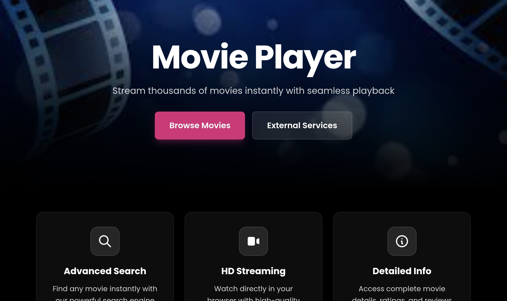
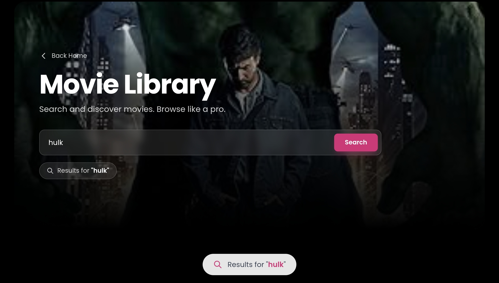
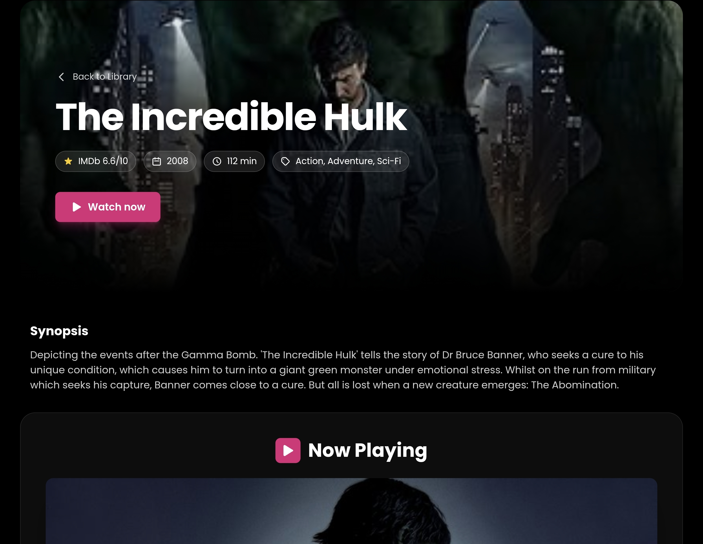
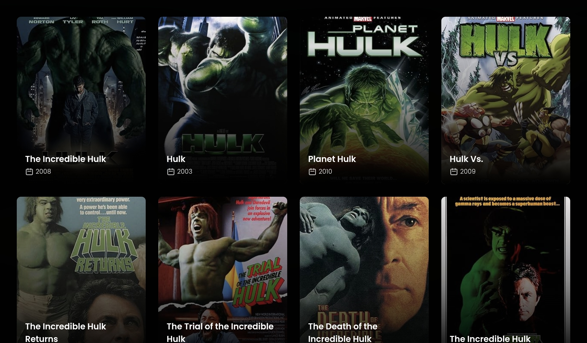

# MovieStream

A web-based movie streaming application that lets you search for movies and watch them directly in your browser. Built with Flask, integrating OMDB API for movie metadata and streaming APIs for video playback.

🔗 **Live Demo:** [movieforcutie.onrender.com](https://movie-player-z7yj.onrender.com/)]

## Features

- **Search movies** by title
- **Browse movie details** (plot, cast, ratings, year, poster)
- **Stream movies** directly in the browser with embedded player
- **Responsive design** - works on mobile and desktop
- **Fast loading** with CDN-based styling (Tailwind CSS)

## How It Works

1. User searches for a movie by title
2. Flask backend queries OMDB API for movie metadata
3. App fetches streaming link using the movie's IMDB ID
4. Video player embedded on the page for instant playback

## Tech Stack

- **Backend:** Python Flask
- **Frontend:** HTML, Tailwind CSS (via CDN), JavaScript
- **APIs:** 
  - [OMDB API](http://www.omdbapi.com/) - Movie metadata (title, plot, ratings, cast)
  - Streaming API - Video playback (movie availability depends on API's content library)
- **Deployment:** Render

## Installation & Setup

### Prerequisites
- Python 3.8+
- OMDB API key
- Streaming API access

## Usage

1. **Search for a movie** on the home page
2. **Browse results** with movie posters and details
3. **Click to watch** - opens player with streaming video
4. **Movie availability** depends on the streaming API's content library

## API Integration

### OMDB API
- Provides movie metadata (title, year, plot, ratings, cast, poster)
- Free tier: 1,000 requests per day
- Returns JSON with comprehensive movie information

### Streaming API
- Provides video streaming links via IMDB ID or OMDB
- Availability varies by movie and region
- Some movies may not have streaming links available

## Environment Variables

Required in `.env` file:
```env
OMDB_API_KEY=your_key          # OMDB API key
STREAM_API_KEY=your_key        # Streaming API key
SECRET_KEY=random_string       # Flask secret key
FLASK_ENV=development          # if real development or production
```

## Screenshots

### Home Page - Search



### Movie Details


### Movie List


## What I Learned

Building this project taught me:
- **API integration:** Working with external APIs (OMDB), handling responses and errors
- **Environment variables:** Securely managing API keys with `.env` files
- **Flask routing:** Creating routes for search, details, and player pages
- **Template rendering:** Passing data from backend to frontend with Jinja2
- **Video embedding:** Integrating third-party video players
- **Responsive design:** Using Tailwind CSS for mobile-friendly layouts
- **Deployment:** Deploying Flask apps to Render with environment variables

## Known Limitations

- **Streaming availability:** Not all movies have streaming links available (depends on the API's content library)
- **Free tier API limits:** OMDB free tier has request limits (1,000/day)
- **No user accounts:** No authentication or favorites feature
- **No download option:** Streaming only, no offline viewing
- **Basic error handling:** Limited feedback when movies aren't available

## Future Improvements

- [ ] Add user authentication and accounts
- [ ] Implement watchlist/favorites feature
- [ ] Add movie recommendations based on viewing history
- [ ] Implement filters (genre, year, rating)
- [ ] Add recently watched history
- [ ] Integrate movie trailers from YouTube API
- [ ] Better error handling and user feedback
- [ ] Add search suggestions/autocomplete
- [ ] Implement caching to reduce API calls

## Development Notes

**Original purpose:** This started as a personal fun project but I've rebranded it to demonstrate API integration and Flask development skills.

**Learning focus:** The main goal was understanding how to:
- Work with external APIs
- Handle API responses and errors gracefully
- Deploy a Flask app with environment variables
- Create a clean, responsive UI

**API limitations:** The streaming availability depends entirely on the third-party API. Some popular movies may not be available, and that's expected behavior.

## Security Notes

- [x] API keys stored in environment variables (never committed to repo)
- [x] `.env` file in `.gitignore`
- [x] Basic error handling for API failures
- [] No rate limiting implemented (relies on API's rate limits)
- [] No input sanitization beyond basic validation

**For production use:** Would add rate limiting, input sanitization, CSRF protection, and proper logging.

**Built with Flask to demonstrate API integration and web development skills.**

**Note:** This is a learning project. Movie availability depends on third-party APIs and may vary. Security are purposely simplified.
